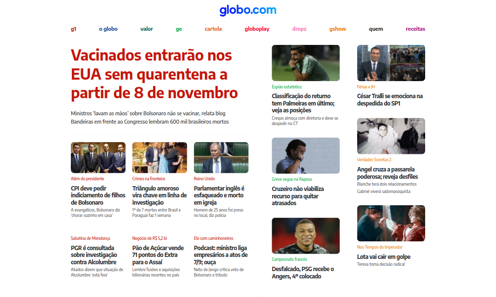
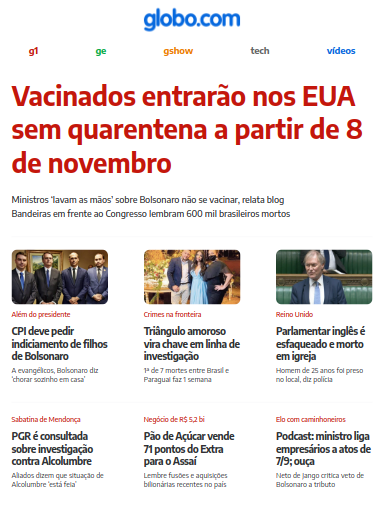
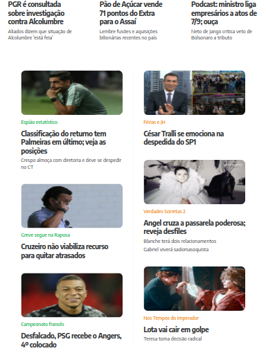
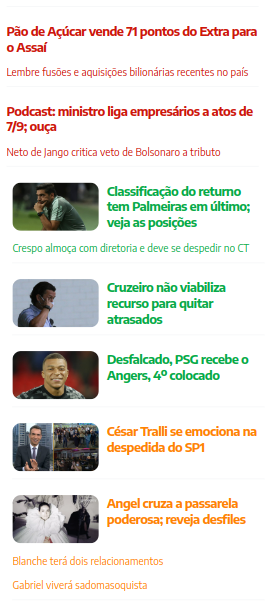

    

# 
Globo

### 
Inspiração do site Globo.com 

   
   
   

### :clipboard: Descrição

Este projeto é um clone do site da [Globo](https://www.globo.com), simplificado, desenvolvido com HTML e CSS. Ele permite visualizar as notícias disponíveis da Globo, com uma interface semelhante à do site original.

#### 🗞️ [Acesse aqui](https://gabrielatiago.github.io/Globo/)

---

### :computer: Telas

##### Desktop:

##### Tablet:

##### Mobile:

$~$

---

### 🎮 Usando

$~$

---

### :books: Lições Aprendidas

- Tags semânticas HTML
- Hierarquia de css
- Flex-box
- Media screen
- Design responsivo

---

### :bulb: Reconhecimentos

- [Badges para Github](https://github.com/alexandresanlim/Badges4-README.md-Profile#-database-)
- [README Inspiração de README](https://gist.github.com/luanalessa/7f98467a5ed62d00dcbde67d4556a1e4#file-readme-md)
- [Driven Education](https://www.driven.com.br)

---

### 👩‍🦱 Autora

- Gabriela Tiago é uma aluna de desenvolvimento web de Fullstack na Driven Education. Percorrendo o caminho do conhecimento, buscando aprimorar suas habilidades técnicas e de softskills, para que ela possa melhorar o trabalho que desenvolve.

 [🔝 De volta ao topo](#globo) 
